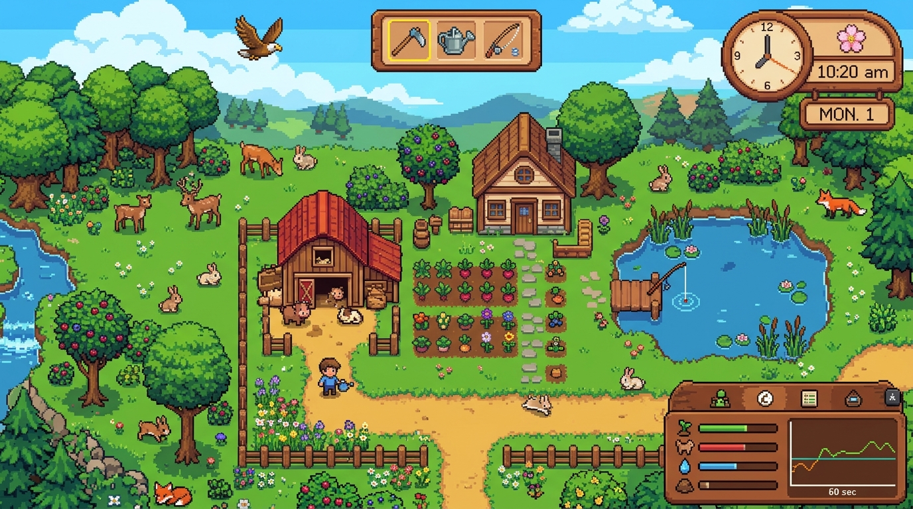
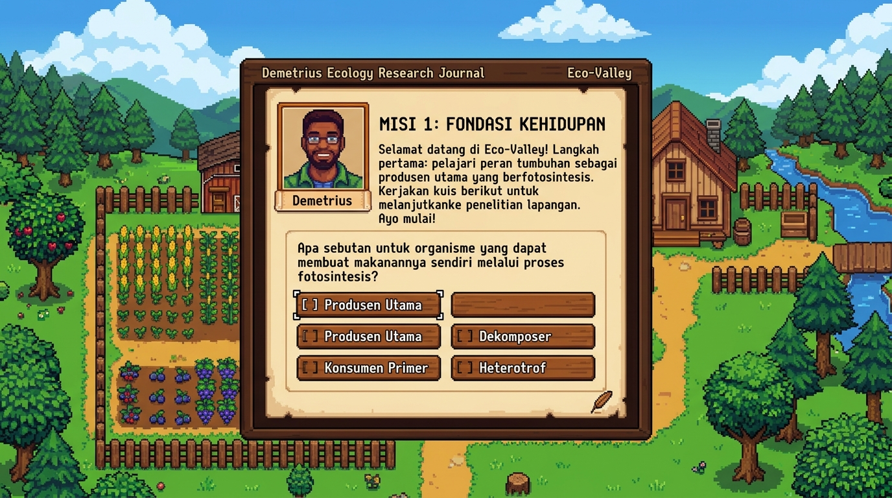

# Eco-Valley: Harmony of the Food Chain

Simulasi santai tentang kehidupan lembah, rantai makanan, dan cara alam menjaga keseimbangannya. Terinspirasi dari nuansa pedesaan Stardew Valley.

---

## Tentang Game

Di Eco-Valley, kamu berperan sebagai peneliti muda yang mengamati kehidupan di sebuah lembah hijau. Di sini, kamu bisa bersantai sambil bereksperimen langsung dengan alam:

- Mengatur jumlah rumput, kelinci, rusa, rubah, elang, dan serigala lewat slider populasi.
- Mengubah cuaca dan musim, mulai dari hujan sejuk di musim semi hingga salju di musim dingin.
- Menyelesaikan 10 jurnal riset dan kuis santai bersama Demetrius untuk memahami cara kerja ekosistem.
- Mengamati reaksi alam ketika salah satu rantai makanan terganggu.

---

## Rantai Makanan di Lembah

Semua makhluk di lembah saling terhubung dan saling membutuhkan:

- **Produsen (Rumput dan Semak Berry)**: Sumber makanan utama yang tumbuh dari sinar matahari dan air.
- **Konsumen I (Kelinci dan Rusa)**: Hewan pemakan tanaman yang menjaga padang rumput tetap terpangkas.
- **Konsumen II (Rubah Merah)**: Menjaga agar kelinci tidak menghabiskan seluruh vegetasi lembah.
- **Konsumen Puncak (Elang Emas dan Serigala)**: Mengontrol populasi hewan di bawahnya agar ekosistem tetap seimbang.
- **Roh Hutan (Junimo)**: Muncul menari saat kondisi lembah berada dalam harmoni yang sehat.

---

## Cara Bermain

- **Jalan**: Tombol W, A, S, D atau tombol Panah (atau D-Pad di layar sentuh).
- **Periksa Sekitar**: Dekati tanaman atau hewan, lalu tekan Spasi atau angka 1.
- **Tanam Rumput**: Tekan angka 2 lalu tekan Spasi untuk menanam tunas baru di tanah.
- **Bicara dengan NPC**: Dekati Demetrius atau Junimo lalu tekan Spasi atau angka 3.
- **Ubah Populasi**: Geser slider di panel kanan bawah untuk melihat perubahan jumlah makhluk hidup secara langsung.

---

## Cara Memulai

- **Mainkan Langsung (Web / Demo Online)**: Kunjungi tautan [https://enidannn.github.io/EcoSimul/](https://enidannn.github.io/EcoSimul/)
- **Mainkan secara Lokal**:
  1. Buka folder proyek ini di komputermu: [EcoSim](file:///d:/TuhanKuatkanAku/EcoSim).
  2. Klik dua kali file [index.html](file:///d:/TuhanKuatkanAku/EcoSim/index.html) untuk membukanya di browser pilihanmu (Chrome, Edge, Firefox, dan lainnya).
  3. Game langsung siap dimainkan tanpa instalasi tambahan.
